### JS中数据类型转换汇总
JS中的数据类型分为
【基本数据类型】
    数字 number
    字符串 string
    布尔 boolean
    空 null
    未定义 undefined
【引用数据类型】
    对象 object
       普通对象
       数组对象 (Array)
       正则对象 (RegExp)
       日期对象 (Date)
       数学函数 (Math)
       ...
    函数 function

真实项目中，根据需求，我们往往需要把数据类型之间进行转换

### 把其它数据类型转换为number类型
`1.发生的情况`
- isNaN检测的时候：当检测的值不是数字类型,浏览器会自己调用Number方法把它先转换为数字，然后再检测是否为非有效数字
```javascript
isNaN('3') =>false
  Number('3')->3
  isNaN(3)->false

isNaN('3px') =>true
  Number('3px')->NaN
  isNaN(NaN)->true
```
- 基于parseInt/parseFloat/Number去手动转换为数字类型
- 数学运算：+ - * / %，但是“+”不仅仅是数学运算，还可能是字符串拼接
```javascript
'3'-1 =>2
  Number('3')->3
  3-1->2

'3px'-1 =>NaN

'3px'+1 =>'3px1' 字符串拼接

var i='3';
i=i+1; =>'31'
i+=1; =>'31'
i++; =>4  i++就是单纯的数学运算，已经摒弃掉字符串拼接的规则
```
- 在基于“==”比较的时候，有时候也会把其它值转换为数字类型
- ...

`2.转换规律`
```javascript
//=>转换的方法：Number（浏览器自行转换都是基于这个方法完成的）

【把字符串转换为数字】
只要遇到一个非有效数字字符，结果就是NaN
'' ->0
' ' ->0 空格(Space)
'\n' ->0 换行符(Enter)
'\t' ->0 制表符(Tab)


【把布尔转换为数字】
true ->1
false ->0

【把没有转换为数字】
null ->0
undefined ->NaN

【把引用类型值转换为数字】
首先都先转换为字符串（toString），然后再转换为数字（Number）
```

### 把其它类型值转换为字符串
`1.发生的情况`
- 基于alert/confirm/prompt/document.write等方法输出内容的时候，会把输出的值转换为字符串，然后再输出
```javascript
alert(1) =>'1'
```
- 基于“+”进行字符串拼接的时候
- 把引用类型值转换为数字的时候，首先会转换为字符串，然后再转换为数字
- 给对象设置属性名，如果不是字符串，首先转换为字符串，然后再当做属性存储到对象中（对象的属性只能是数字或者字符串）
- 手动调用toString/toFixed/join/String等方法的时候，也是为了转换为字符串
```javascript
var n=Math.PI;//=>获取圆周率：
n.toFixed(2) =>'3.14'

var ary=[12,23,34];
ary.join('+') =>'12+23+34'
```
- ...

`2.转换规律`
```javascript
//=>调用的方法：toString

【除了对象，都是你理解的转换结果】
1 ->'1'
NaN ->'NaN'
null ->'null'
[] ->''
[13] ->'13'
[12,23] ->'12,23'
...

【对象】
{name:'xxx'} ->'[object Object]'
{} ->'[object Object]'
不管是啥样的普通对象，最后结果都一样
```

### 把其它值转换为布尔类型
`1.发生的情况`
- 基于!/!!/Boolean等方法转换
- 条件判断中的条件最后都会转换为布尔类型
- ...
```javascript
if(n){
  //=>把n的值转换为布尔验证条件真假
}

if('3px'+3){
  //=>先计算表达式的结果'3px3'，把结果转换为布尔true，条件成立
}
```

`2.转换的规律`
只有“0/NaN/''/null/undefined”五个值转换为布尔的false,其余都是转换为true


### 特殊情况：数学运算和字符串拼接 “+”
```javascript
//=>当表达式中出现字符串，就是字符串拼接，否则就是数学运算

1+true =>2 数学运算
'1'+true =>'1true' 字符串拼接

[12]+10 =>'1210' 虽然现在没看见字符串，但是引用类型转换为数字，首先会转换为字符串，所以变为了字符串拼接
({})+10 =>"[object Object]10"
[]+10 =>"10"

{}+10 =>10 这个和以上说的没有半毛钱关系，因为它根本就不是数学运算，也不是字符串拼接，它是两部分代码
  {} 代表一个代码块（块级作用域）
  +10 才是我们的操作
  严格写法：{}; +10;
```

思考题：
```javascript
12+true+false+null+undefined+[]+'珠峰'+null+undefined+[]+true
=>'NaN珠峰nullundefinedtrue'

12+true ->13
13+false ->13
13+null ->13
13+undefined ->NaN
NaN+[] ->'NaN'
'NaN'+'珠峰' ->'NaN珠峰'
...
'NaN珠峰trueundefined'
'NaN珠峰trueundefined'+[] ->'NaN珠峰trueundefined'
...
=>'NaN珠峰trueundefinedtrue'
```

### 特殊情况：“==”在进行比较的时候，如果左右两边的数据类型不一样，则先转换为相同的类型，再进行比较

对象==对象：不一定相等，因为对象操作的是引用地址，地址不相同则不相等
```javascript
{name:'xxx'}=={name:'xxx'} =>false
[]==[] =>false

var obj1={};
var obj2=obj1;
obj1==obj2 =>true
```
-------------------------------------上面是重点强调的

对象==数字：把对象转换为数字
对象==布尔：把对象转换为数字，把布尔也转换为数字
对象==字符串：把对象转换为数字，把字符串也转换为数字
字符串==数字：字符串转换为数字
字符串==布尔：都转换为数字
布尔==数字：把布尔转换为数字
-----------------------------------不同情况的比较，都是把其它值转换为数字，然后再进行比较的

null==undefined：true
null===undefined：false
null&&undefined和其它值都不相等

NaN==NaN：false
NaN和谁都不相等包括自己
-----------------------------------以上需要特殊记忆

```javascript
1==true =>true
1==false =>false
2==true =>false  规律不要混淆，这里是把true变为数字1


[]==true：false  都转换为数字 0==1
![]==true：false

[]==false：true  都转换为数字 0==0
![]==false：true  先算![]，把数组转换为布尔取反=>false  =>false==false
```

### 关于JS数组常用方法的剖析
数组也是对象数据类型的，也是由键值对组成的
```javascript
var ary = [12,23,34];
/*
 * 结构:
 *  0:12
 *  1:23
 *  2:34
 *  length:3 
 */
1. 以数组作为索引（属性名），索引从零开始递增
2. 有一个LENGTH属性存储的是数组长度

ary[0] 获取第一项
ary[ary.length-1] 获取最后一项
```
数组中每一项的值可以是任何数据类型的
```javascript
//=>多维数组
var ary = [
	{
	  name:'xxx',
	  age:20
	},
	{
	  name:'xxx',
	  age:20
	}
];
```

### 数组中的常用方法
> 按照四个维度记忆：
> - 方法的作用
> - 方法的参数
> - 方法的返回值
> - 原有数组是否改变

**`push`**
作用：向数组“末尾”追加新的内容
参数：追加的内容（可以是一个，也可是多个）
返回值：新增后数组的长度
原有数组改变
```javascript
var ary = [12,23,34];
ary.push(100); //=>4  ary:[12,23,34,100]
ary.push(100,{name:'xxx'}); //=>6  ary:[12,23,34,100,100,{...}]
```

**`pop`**
作用：删除数组最后一项
参数：无
返回：被删除的那一项内容
原有数组改变
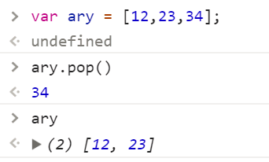

**`shift`**
作用：删除数组中的第一项
参数：无
返回：被删除的那一项内容
原有数组改变
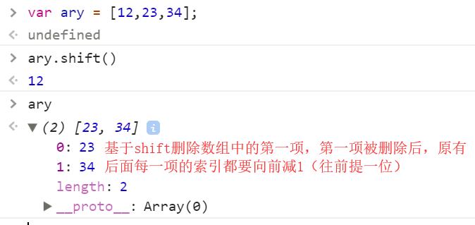

**`unshift`**
作用：向数组开始位置追加新内容
参数：要新增的内容
返回：新增后数组的长度
原有数组改变
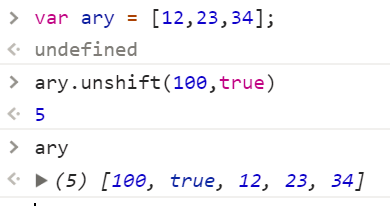

**`splice`**
基于 SPLICE可以对数组进行很多的操作：删除指定位置的内容、向数组指定位置增加内容、还可以修改指定位置的信息

`删除：ary.splice(n,m)`
从索引n开始，删除m个内容，把删除的部分以一个新数组返回，原有数组改变
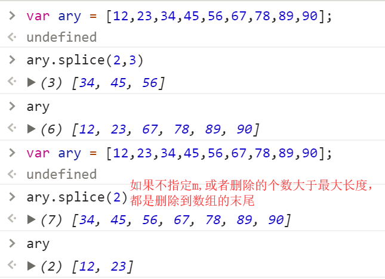

`新增：ary.splice(n,0,x,...)`
从索引n开始删除零项（没删除），把X或者更多需要插入的内容存放到数组中索引N的“前面”
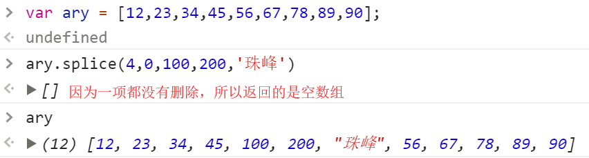

`修改：ary.splice(n,m,x,...)`
修改的原理就是把原有内容删除掉，然后用新的内容替换这部分信息即可
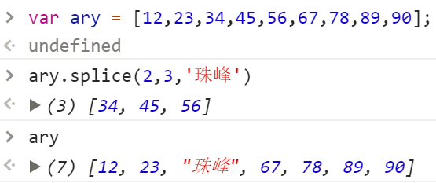

> 需求扩展：
> 1. 删除数组最后一项，你有几种办法?
> 2. 向数组末尾追加新内容，你有几种办法?
```javascript
//=>删除最后一项
ary.pop()
ary.splice(ary.length-1)
ary.length--

//=>向数组末尾追加新内容
ary.push(100)
ary.splice(ary.length,0,100)
ary[ary.length]=100
```
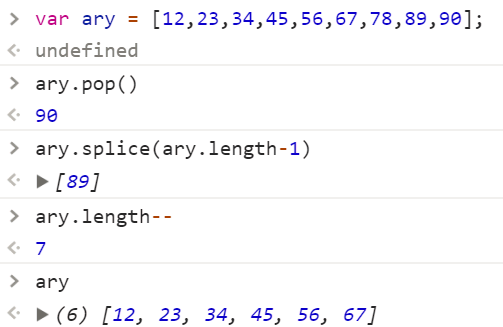
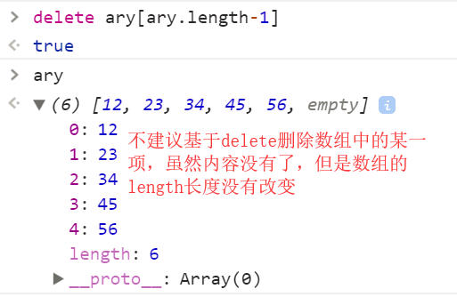

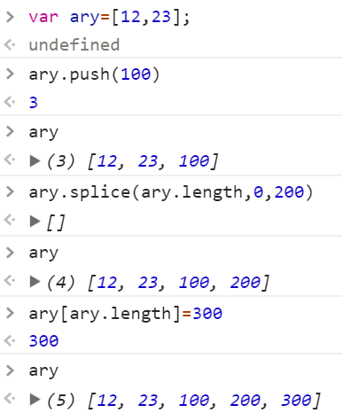

**`slice`**
作用：在一个数组中，按照条件查找出其中的部分内容
参数：两个参数（n/m），从索引n开始，找到索引m处，但是不包含m
返回：以一个新数组存储查找的内容
原有数组不会变
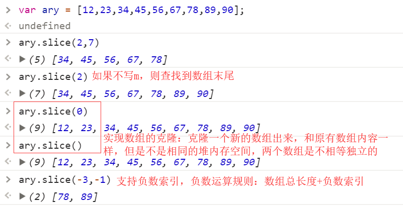

**`concat`**
作用：实现多个数组(或者值)的拼接
参数：数组或者值
返回：拼接后的新数组
原有数组不变
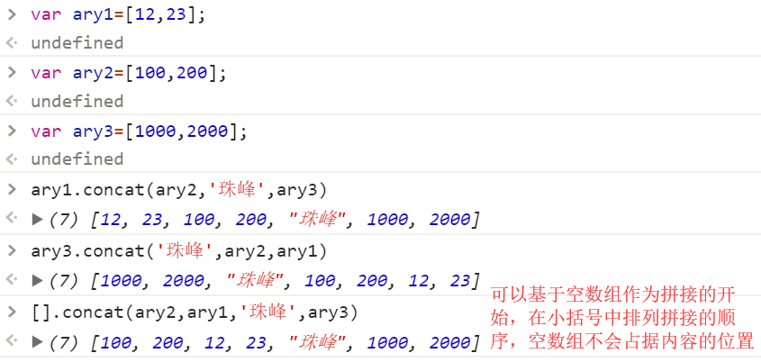

**`toString`**
作用：把数组转换为字符串
参数：无
返回：数组中的每一项用逗号分隔的字符串
原有数组不变 

**`join`**
作用：和toString类似，也是把数组转换为字符串，但是我们可以设置变为字符串后，每一项之间的连接符
参数：指定的链接符
返回：字符串
原有数组不变 
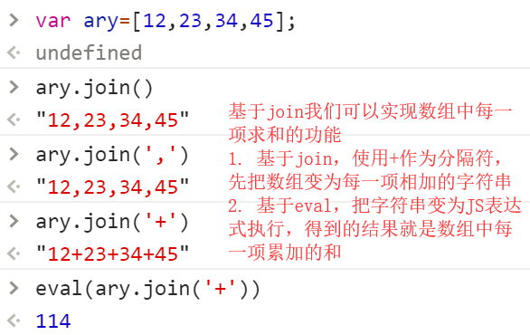

**`reverse`**
作用：把数组倒过来排列
参数：无
返回：排列后的新数组
原有数组改变
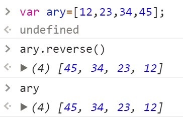

**`sort`**
作用：给数组排序
参数：无/函数
返回：排序后的新数组
原有数组改变

```javascript
//=>sort在不传递参数的情况下，只能处理10以内数字排序
var ary=[1,3,2,4,5,6,7,9,8];
ary.sort(); =>[1,2,3,4,5,6,7,8,9]

var ary=[18,1,23,27,2,35,3,56];
ary.sort(); =>[1, 18, 2, 23, 27, 3, 35, 56] 没有按照我们想象中的排序

//=>真实项目中，基于sort排序，我们都需要传递参数
var ary=[18,1,23,27,2,35,3,56];
ary.sort(function (a,b){
	return a-b;//=>升序  return b-a; 降序
});
```

**`indexOf / lastIndexOf`**
这两个方法不兼容IE低版本浏览器(IE6~8)
作用：检测当前值在数组中第一次或者最后一次出现位置的索引
参数：要检测的值
返回：索引
原有数组不变
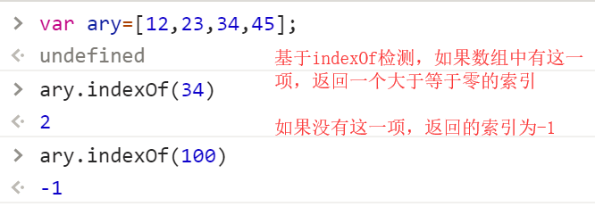

```javascript
//=>验证数组中是否包含某一项
if(ary.indexOf(100)>-1){
   //=>ARY中包含100这一项
}
```

除了以上方法，数组中还包含很多常用的方法（Array.prototype）
- every
- filter
- find
- forEach
- includes
- keys
- map
- reduce / reduceRight
- some
- ...

第一阶段咱们不深入研究这些方法，搞懂这些方法需要了解OOP/作用域/回调函数等，第二阶段咱们在去研究这些


